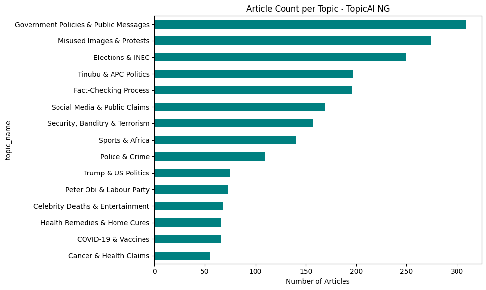
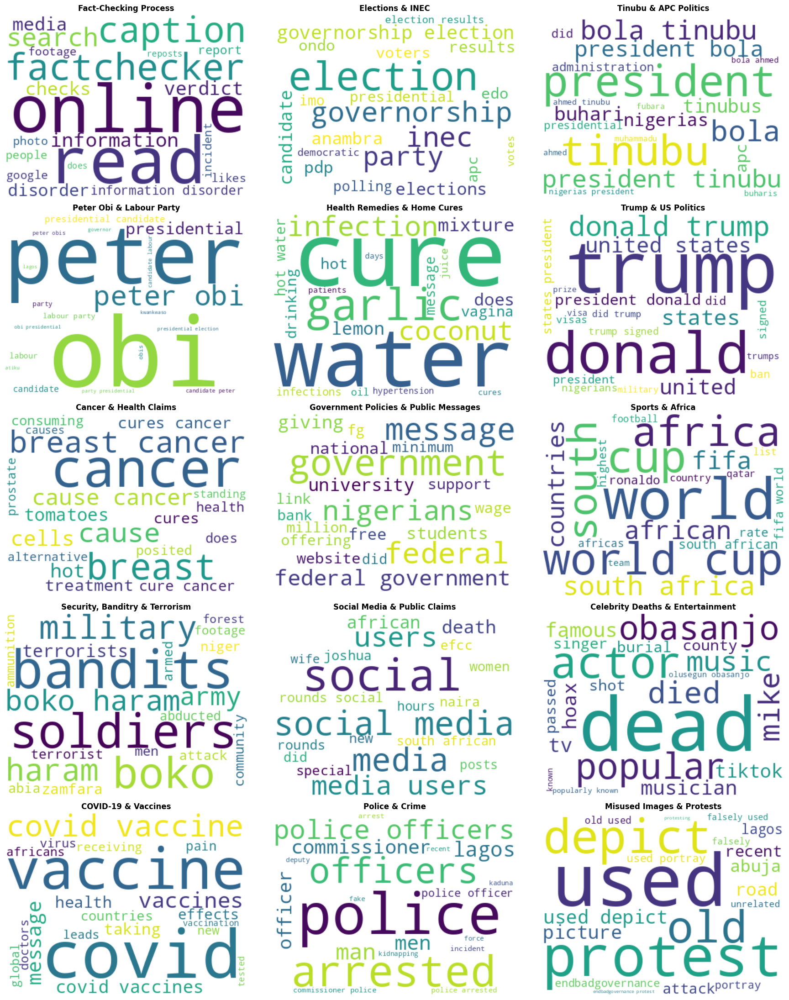

# TopicAI NG — Nigerian News Topic Modeling

**3MTT NextGen Project Brief:** DS-08 — Nigerian News Topic Modeling
**Track:** Data Science (Beginner–Intermediate)
**Author:** Furutan Samuel

## Problem Context

News and claim volume in Nigeria is overwhelming — fact-checkers and readers alike struggle to keep up with the sheer number of stories and claims circulating daily. This project applies unsupervised topic modeling to automatically discover the major themes running through a large body of real Nigerian news and fact-check content, without manually labeling any of it in advance.

## Dataset

- **Source:** Nigerian Fact-Check Master Dataset — a combined collection of real, published fact-checks from **Dubawa** (dubawa.org) and **FactCheckHub** (factcheckhub.com), two established Nigerian fact-checking organizations.
- **Size:** 2,436 rows originally; **2,205 rows** after cleaning.
- **Fields used:** `news_headline`, `news_source_text` (claim/article text), `news_category` (existing label, used only for evaluation).

### Data Cleaning Notes

- Removed 34+ rows covering non-Nigerian West African countries (Benin, Guinea, Senegal, Guinea-Bissau, Liberia, Burkina Faso) that were present because Dubawa's coverage spans the wider West Africa region, not just Nigeria — kept in scope with the brief's Nigerian focus.
- Lowercased text, stripped URLs, punctuation, and numbers.
- Removed standard English stopwords plus a custom list of fact-check "boilerplate" words (e.g. *claim, facebook, whatsapp, viral, shared*) that otherwise dominated the model with writing-style patterns instead of real subject matter.

## Method

- **Text vectorization:** TF-IDF (unigrams + bigrams, top 5,000 features, `min_df=5`, `max_df=0.85`)
- **Topic model:** Non-negative Matrix Factorization (NMF)
- **Number of topics:** 15 — chosen after testing values from 4 to 25; topic keyword overlap (redundant/repeating topics) began appearing beyond ~18, indicating 15 sits near the natural limit of distinct topics the data supports.

## Discovered Topics

| # | Topic | Example Keywords |
|---|---|---|
| 0 | Fact-Checking Process | factchecker, verdict, caption, search |
| 1 | Elections & INEC | election, governorship, inec, anambra, pdp |
| 2 | Tinubu & APC Politics | tinubu, buhari, apc |
| 3 | Peter Obi & Labour Party | obi, labour party, presidential candidate |
| 4 | Health Remedies & Home Cures | cure, garlic, water, coconut |
| 5 | Trump & US Politics | trump, united states |
| 6 | Cancer & Health Claims | cancer, breast cancer, tomatoes |
| 7 | Government Policies & Public Messages | federal government, students, university |
| 8 | Sports & Africa | world cup, fifa, south africa |
| 9 | Security, Banditry & Terrorism | bandits, boko haram, military, army |
| 10 | Social Media & Public Claims | social media, efcc, naira |
| 11 | Celebrity Deaths & Entertainment | obasanjo, actor, musician |
| 12 | COVID-19 & Vaccines | covid, vaccine, health effects |
| 13 | Police & Crime | police, arrested, officers, lagos |
| 14 | Misused Images & Protests | protest, depict, old, picture |

## Evaluation

Discovered topics were cross-checked against the dataset's existing `news_category` labels (which the model never saw during training) to sanity-check whether the patterns found were meaningful.

**Strong alignment (10 of 15 topics):**
- Security, Banditry & Terrorism → 90/156 rows matched real "Security" label
- Elections & INEC → 149/246 matched real "Elections"
- Tinubu & APC Politics → 78/192 matched real "Politics"
- Cancer & Health Claims / Health Remedies & Home Cures → both dominated by real "Health"

**Weaker alignment, with explanation:**
- *Fact-Checking Process* mostly fell under the vague "General" label — this is expected, since this topic captures the *language of verification itself* (words like "verdict," "caption"), not a news subject.
- *Misused Images & Protests* and *Social Media & Public Claims* spread across multiple categories rather than one dominant match, since they cut across several real-world subjects at once.
- *Trump & US Politics* and *Sports & Africa* had no equivalent label in the original data at all — expected, since these fall outside Nigeria's domestic news classification system.

## Visualizations

**Article count per topic:**

**Word clouds per topic:**

## Tools Used

Python, pandas, scikit-learn (TF-IDF, NMF), NLTK, Matplotlib, WordCloud, Google Colab

## Repository Contents

- `Nigerian_News_Topic_Modeling.ipynb` — full notebook (cleaning, modeling, evaluation, visualizations)
- `README.md` — this file
- `topic_counts.png`, `topic_wordclouds.png` — output visualizations
- Demo video (linked below)

## Demo Video

*[Add your video link here after uploading — e.g. YouTube unlisted link or Google Drive link]*

## Limitations & Future Work

- Text is short-form (headlines/claims), not full-length articles — future work could apply this to full Punch/Vanguard/Premium Times articles for richer topic granularity.
- Some topics (e.g. Fact-Checking Process) reflect writing style rather than subject matter; further stopword tuning could isolate subject-only topics more precisely.
- Could be extended into a live app (Streamlit) allowing users to paste any headline and get an instant topic prediction.
